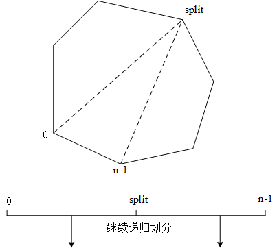
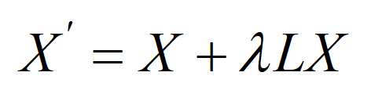
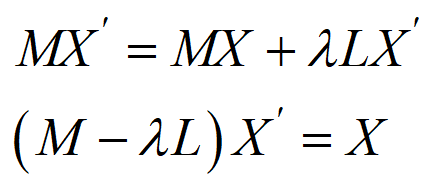
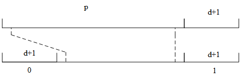
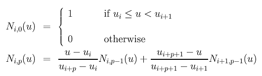
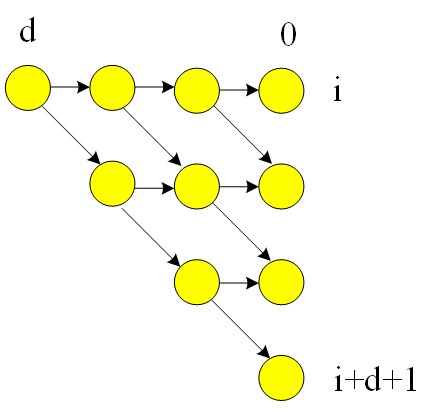
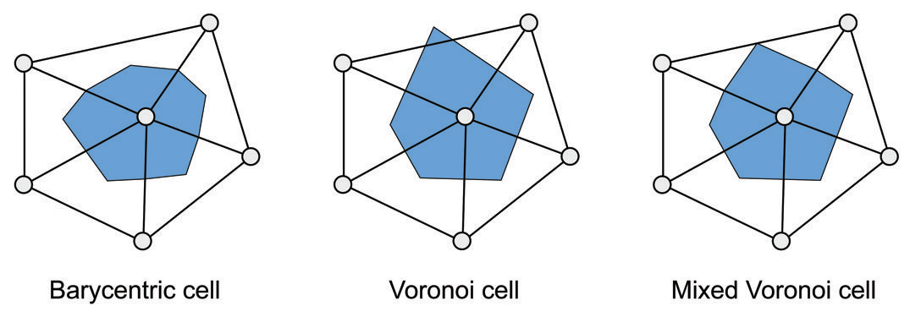
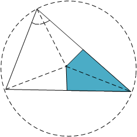

##### Triangulation

将一个Poly三角化，如有n个顶点：

- 在0到n-1之间找到一个spilt，split是最佳划分。可以得到一个三角形。
- 然后对子区间按照同样的方法递归划分，最终将Poly三角化。
- 计算最佳划分split时，会为这个三角形计算一个代价（可以是面积的平方），加上左右区间的代价。通过最小化总代叫确定split

$$
[0,n-1]
$$



具体实现是利动态规划做预计算，算出每个区间对应的最佳划分split。

伪代码

```c++
void Triangulation::triangulate(Face f)
{
    // collect polygon halfedges
    Halfedge h0 = mesh_.halfedge(f);
    halfedges_.clear();
    vertices_.clear();
    Halfedge h = h0;
    do
    {
        if (!mesh_.is_manifold(mesh_.to_vertex(h)))
        {
            auto what = std::string{ __func__ } + ": Non-manifold polygon";
            throw InvalidInputException(what);
        }

        halfedges_.emplace_back(h);
        vertices_.emplace_back(mesh_.to_vertex(h));
    } while ((h = mesh_.next_halfedge(h)) != h0);

    // do we have at least four vertices?
    const auto n = halfedges_.size();
    if (n <= 3)
        return;

    // compute minimal triangulation by dynamic programming
    weight_.clear();
    weight_.resize(n,
        std::vector<Scalar>(n, std::numeric_limits<Scalar>::max()));
    index_.clear();
    index_.resize(n, std::vector<int>(n, 0));

    // initialize 2-gons
    for (size_t i = 0; i < n - 1; ++i)
    {
        weight_[i][i + 1] = 0.0;
        index_[i][i + 1] = -1;
    }

    // n-gons with n>2
    for (size_t j = 2; j < n; ++j)
    {
        // for all n-gons [i,i+j]
        for (size_t i = 0; i < n - j; ++i)
        {
            auto k = i + j;
            auto wmin = std::numeric_limits<Scalar>::max();
            auto imin = -1;

            // find best split i < m < i+j
            for (size_t m = i + 1; m < k; ++m)
            {
                Scalar w =
                    weight_[i][m] + compute_weight(i, m, k) + weight_[m][k];

                if (w < wmin)
                {
                    wmin = w;
                    imin = m;
                }
            }

            weight_[i][k] = wmin;
            index_[i][k] = imin;
        }
    }

    // now add triangles to mesh
    std::vector<ivec2> todo;
    todo.reserve(n);
    todo.emplace_back(0, n - 1);
    while (!todo.empty())
    {
        ivec2 tri = todo.back();
        todo.pop_back();
        int start = tri[0];
        int end = tri[1];
        if (end - start < 2)
            continue;
        int split = index_[start][end];

        insert_edge(start, split);
        insert_edge(split, end);

        todo.emplace_back(start, split);
        todo.emplace_back(split, end);
    }

    // clean up
    weight_.clear();
    index_.clear();
    halfedges_.clear();
    vertices_.clear();
}

```

##### Smooth

算mesh拉普拉斯算子，对mesh坐标进行偏移，达到光滑的效果。

分为explicit_smoothing和implicit_smoothing两种。

在explicit_smoothing中：利用laplace矩阵得到偏移量，然后偏移坐标，可迭代多次。



在implicit_smoothing中：通过构造smooth后坐标矩阵的隐式方程，然后求解线性系统，得到smooth结果




#### Nurbs

##### average_knot_vector

给出一堆离散点（通常遍布了nurbs curve）的参数，根据阶数生成，采用平均的方式生成节向量。

- 首尾degree+1个节元素为0或1
- 中间的节元素，为degree长度的区间上参数求平均。



##### bspline_one_basis

B样条基函数的计算：



采用递归的方式计算复杂度较高，可采用迭代的方式计算,在迭代方式计算中采用动态规划的方式。

1. 先把第0阶的基函数算出来，然后也一直向前递推到计算到d阶基函数。
2. 最开始需要i到i+d对应顶点的0阶基函数（图中标注应该是i+d）
3. 然后高阶利用低阶的结果计算



```c++
inline scalar bspline_one_basis(int32 i, size_t deg, const Array<scalar>& U, scalar u)
{
    int32 m = static_cast<int32>(U.size()) - 1;
    // Special case
    if((i == 0 && close(u, U[0])) || (i == m - deg - 1 && close(u, U[m])))
    {
        return 1.0;
    }
    // Local property ensures that basis function is zero outside span
    if(u < U[i] || u >= U[i + deg + 1])
    {
        return 0.0;
    }
    // Initialize zeroth-degree functions
    Array<scalar> N;
    N.resize(deg + 1);
    for(auto j: IndexRange(deg + 1))
    {
        N[j] = (u >= U[i + j] && u < U[i + j + 1]) ? 1.0 : 0.0;
    }
    // Compute triangular table
    for(auto k: IndexRange<size_t>(1, deg + 1))
    {
        scalar saved = (close(N[0], 0.0)) ? 0.0 : ((u - U[i]) * N[0]) / (U[i + k] - U[i]);
        for(auto j: IndexRange(deg - k + 1))
        {
            scalar Uleft = U[i + j + 1];
            scalar Uright = U[i + j + k + 1];
            if(close(N[j + 1], 0.0))
            {
                N[j] = saved;
                saved = 0.0;
            }
            else
            {
                scalar temp = N[j + 1] / (Uright - Uleft);
                N[j] = saved + (Uright - u) * temp;
                saved = (u - Uleft) * temp;
            }
        }
    }
    return N[0];
}
```

计算mesh上一个顶点的局部面积：



对每个三角形，由顶点连接的两边中心与重心或者外心来确定顶点的面积，如Barycentric为重心 voronoi为外心，Mixed Voronoi为外心在三角形外部时，用钝角对边中心代替。

这样计算的顶点邻域面积，可以用来计算mesh的质量矩阵M，计算M时最核心的算法是从三角形中计算顶点的邻域面积，然后组装不同三角形顶点的邻域面积。

对于Voronoi，可以由边与对角余切得到面积，因为存在一个两倍的关系：



伪代码:

```c++
void triangle_mass_matrix(const Eigen::Vector3d& p0, const Eigen::Vector3d& p1,
    const Eigen::Vector3d& p2, Eigen::DiagonalMatrix<double, Eigen::Dynamic>& Mtri)
{
    // three vertex positions
    const std::array<dvec3, 3> p = { p0, p1, p2 };

    // edge vectors
    std::array<dvec3, 3> e;
    for (int i = 0; i < 3; ++i)
        e[i] = p[(i + 1) % 3] - p[i];

    // compute and check (twice the) triangle area
    const auto tri_area = norm(cross(e[0], e[1]));
    if (tri_area <= std::numeric_limits<double>::min())
    {
        Mtri.setZero(3);
        return;
    }

    // dot products for each corner (of its two emanating edge vectors)
    std::array<double, 3> d;
    for (int i = 0; i < 3; ++i)
        d[i] = -dot(e[i], e[(i + 2) % 3]);

    // cotangents for each corner: cot = cos/sin = dot(A,B)/norm(cross(A,B))
    std::array<double, 3> cot;
    for (int i = 0; i < 3; ++i)
        cot[i] = d[i] / tri_area;

    // compute area for each corner
    Eigen::Vector3d area;
    for (int i = 0; i < 3; ++i)
    {
        // angle at corner is obtuse
        if (d[i] < 0.0)
        {
            area[i] = 0.25 * tri_area;
        }
        // angle at some other corner is obtuse
        else if (d[(i + 1) % 3] < 0.0 || d[(i + 2) % 3] < 0.0)
        {
            area[i] = 0.125 * tri_area;
        }
        // no obtuse angles
        else
        {
            //外心在内部，利用了二倍角
            area[i] = 0.125 * (sqrnorm(e[i]) * cot[(i + 2) % 3] +
                sqrnorm(e[(i + 2) % 3]) * cot[(i + 1) % 3]);
        }
    }

    Mtri = area.asDiagonal();
}
```

